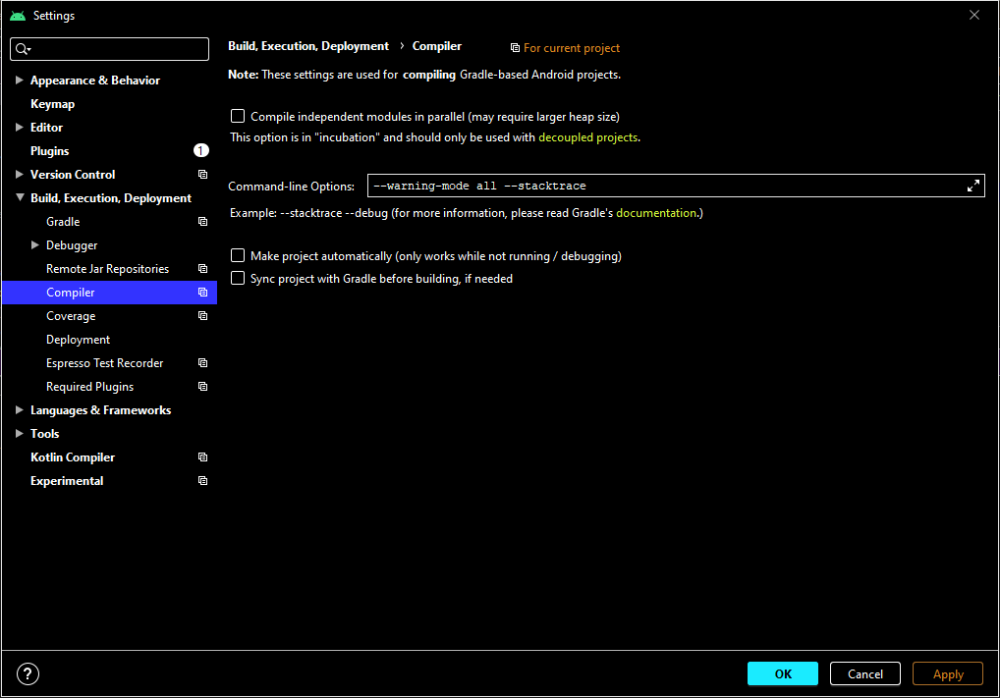

# My (uwsd) works on:

> ## The Comprehensive Android Developer Bootcamp
By Paulo Dichone, May 2020, [Packtpub eBook](https://subscription.packtpub.com/video/mobile/9781800561083)

[](https://img.shields.io/badge/Android%20Studio-4.0-blue)
[](https://img.shields.io/badge/My%20Work%20Progress-8%25-orange)

---
## Important shortcuts for Android Studio
- `Ctrl+Shift+Enter`: Auto Semicolon
- `Ctrl+Shift+Enter twice`:  Auto Semicolon + newline
- **sout**: System.out.println();
- **psvm**: public static void main(String[] args) {}

---
## Gradle error "Deprecated Gradle features were used in this build"
```
Deprecated Gradle features were used in this build, making it incompatible with Gradle 6.0.
Use '--warning-mode all' to show the individual deprecation warnings.
```

To see details of the error messages add the following compiler options (from https://stackoverflow.com/questions/54619731/add-warning-mode-all-command-line-argument-in-android-studio):



Me helped the solution from https://stackoverflow.com/questions/59094029/unnecessarily-replacing-a-task-that-does-not-exist-is-not-supported?#59187223:

**If you are using gradle then delete your .gradle folder and run gradle again.**

This solution means: Close Android Studio, then simple delete the .gradle folder and rerun Android Studio and this error should be gone.

---
